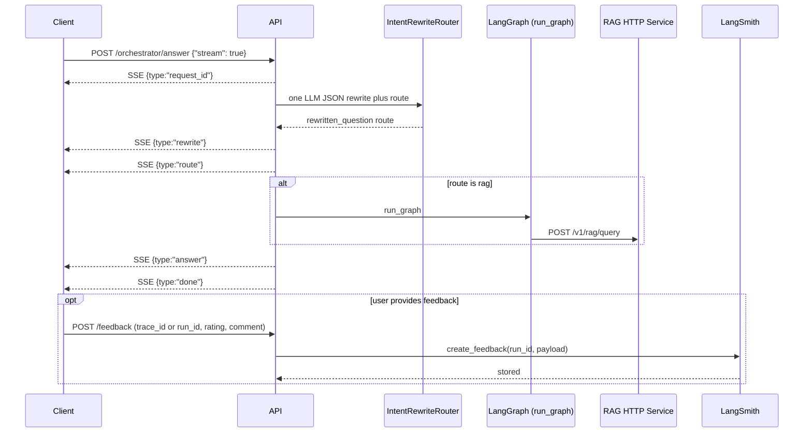

## 🔄 `/orchestrator/answer` (`stream=true`) — SSE Execution Flow

This endpoint provides a **streaming, reliability-first orchestration pipeline** for answering questions using RAG tools.

It emits **Server-Sent Events (SSE)** so clients can observe each reasoning stage in real time.

---

### ✅ 1. Request Initialization

* The service **accepts or generates** a `request_id`.
* Immediately emits:

```json
{ "type": "request_id", "request_id": "<uuid>" }
```

This ID is propagated through:

* LangGraph runs
* RAG HTTP query requests
* LangSmith traces
* Feedback API

---

### ✍️ 2–3. Intent / rewrite router (one LLM)

One gateway call returns **JSON only**: `rewritten_question`, `route` (`rag` \| `direct_reply` \| `clarify` \| `reject`), `can_answer_directly`, `direct_answer`, `reason`. Optional conversation `history` in the request body is included in the router prompt. A small server-side guard can force `rag` when the model chose `direct_reply` but the topic matches sensitive/private patterns (visa, sponsorship, compensation, etc.).

SSE emissions (after the router completes):

```json
{ "type": "rewrite", "text": "<rewritten question>" }
{ "type": "route", "route": "rag" }
```

`route` is lowercase. For `direct_reply`, `clarify`, or `reject`, the pipeline returns `direct_answer` (or a default) as the final `answer` and skips LangGraph.

---

### ⚙️ 4. RAG execution (when `route` is `rag`)

When `RAG_HTTP_BASE_URL` is set and the router chose `rag`, the orchestrator runs LangGraph once.

---

### 🧠 5. `run_graph()` — LangGraph Agent Execution

The RAG phase invokes `run_graph()` only on the `rag` path:

#### a. Runs HTTP RAG once inside LangGraph

```
retrieve → POST /v1/rag/query → evidence as answer payload
```

#### b. Captures the **root LangSmith run_id** (internal / logs only)

The graph callback records the LangSmith root run id for **server logs and observability**. Clients correlate requests with **`trace_id`** (header `X-Trace-Id` / JSON `trace_id`); **`POST /feedback`** accepts `trace_id`, `request_id`, or `agent_graph_run_id` (LangSmith UUID) for `create_feedback`.

---

### 📤 6. Final Answer Emission

After the phase completes:

```json
{
  "type": "answer",
  "text": "<final answer>"
}
```

---

### 🏁 7. Completion or Failure Signal

Success:

```json
{ "type": "done" }
```

Failure:

```json
{ "type": "error", "message": "<reason>" }
```

---

## 📡 Event Stream Example

```
request_id  → trace identity established
rewrite     → normalized query
route       → execution plan chosen
state       → phase progress updates
answer      → RAG-formatted retrieval text, or router `direct_reply` / `clarify` / `reject` text
done        → stream completed
```

---

## 🧩 Why This Architecture Exists

This flow is intentionally designed to solve common LLM production failures:

| Problem                    | Solution in This Pipeline                       |
| -------------------------- | ----------------------------------------------- |
| Hallucination              | Single RAG hop; user-visible text is RAG output (no extra answer LLM in graph) |
| Wrong data source          | Single RAG tool (no routing)                    |
| Unobservable failures      | SSE phase visibility                            |
| Weak retrieval queries     | Router rewrites to a standalone search query   |
| User feedback disconnected | `trace_id` / `request_id` / optional LangSmith UUID on `/feedback` |

---

## 🗺️ Simplified Sequence Diagram


---

This endpoint is the **primary production interface** for orchestrated LLM reasoning over RAG knowledge systems.
