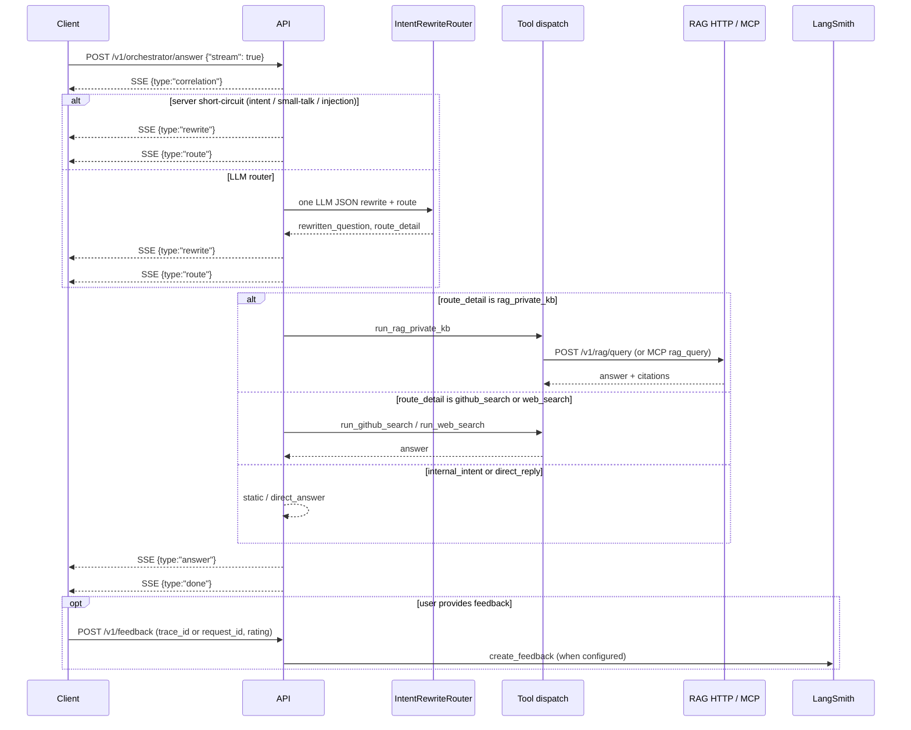

## `/v1/orchestrator/answer` — execution flow

This endpoint provides a **streaming, reliability-first orchestration pipeline** for answering questions over Taixing-focused knowledge.

It emits **Server-Sent Events (SSE)** when `stream=true` so clients can observe rewrite, route, and answer stages in real time.

---

### 1. Request initialization

* The service **accepts or generates** correlation ids from headers (`X-Request-Id`, `X-Session-Id`, `X-Trace-Id`).
* Optional **`conversation_id`** in the JSON body selects the thread id; blank → server assigns `conv_<uuidhex>`.
* Immediately emits:

```json
{
  "type": "correlation",
  "request_id": "<uuid>",
  "session_id": "<string | null>",
  "trace_id": "<string>",
  "conversation_id": "<string>",
  "is_new_conversation": false
}
```

These ids propagate through router LLM calls, tool/RAG HTTP requests, structured logs, and optional LangSmith traces.

---

### 2–3. Intent / rewrite router (one LLM when no short-circuit)

One gateway call returns **JSON only**: `rewritten_question`, `route`, optional nested `route_detail`, `direct_answer`, `reason`.

**Before** that call, the server may short-circuit on:

- **Deterministic internal intents** (`identity`, `greeting`, `help`, `capabilities`) via `app/intents/` — checked in `app/core/pipeline.py` **before** `run_intent_rewrite_router` is invoked (`resolve_route`)
- **Deterministic GitHub repo** (HuntAI / layer-orchestrator / gateway architecture) via `app/core/github_route.py` — same pre-LLM `resolve_route` path; also post-LLM override when the router chose `rag` by mistake
- Inside **`run_intent_rewrite_router`** (`app/core/intent_router.py`): **prompt-injection guard** → `reject`; **empty-history small-talk seed** → `direct_reply` (no router LLM)

See [intent-router.md](intent-router.md) for the full pipeline.

SSE emissions (after routing completes):

```json
{ "type": "rewrite", "text": "<rewritten question>" }
{ "type": "route", "route": "rag", "route_detail": { "type": "tool", "name": "rag_private_kb" } }
```

`route` is the **legacy flat** string (`rag`, `direct_reply`, `clarify`, `reject`, `tool`). Nested `route_detail` names the concrete handler.

---

### 4. Branch: internal intent | direct answer | tool

After routing, `app/core/pipeline.py` dispatches **directly** (no LangGraph on the default path):

| `route_detail` | Handler | Legacy `route` |
|----------------|---------|----------------|
| `internal_intent` (`identity`, `greeting`, `help`, `capabilities`, `clarify`, `reject`) | Static or router `direct_answer` | `direct_reply`, `clarify`, or `reject` |
| `tool:rag_private_kb` | MCP `rag_query` (stream) or HTTP RAG when `USE_MCP_RAG=false` | `rag` |
| `tool:github_search` | MCP `ask_repo` | `tool` |
| `tool:web_search` | Tavily search | `tool` |

Tool phases emit internal `state` events (`phase`: `rag` or `tool`) for logs, metrics, and `latency_ms` aggregation. **SSE clients do not receive `state` events**; they see `rewrite` → `route` → **`answer_delta`** (chunks and/or terminal chunk with citations) → `done`.

---

### 5. Final answer emission

```json
{ "type": "answer_delta", "text": "<answer text chunk or full reply>" }
```

Citations, `follow_up_questions`, and `usage` appear on **`done`** only.

On the `rag` path, `text` is verbatim RAG-formatted retrieval output (no separate answer-synthesis LLM in the pipeline).

---

### 6. Completion or failure

Success:

```json
{ "type": "done", "latency_ms": {}, "usage": {} }
```

Failure:

```json
{ "type": "error", "text": "<reason>" }
```

---

## Event stream example (SSE)

```
request_id  → trace identity established
rewrite     → normalized query
route       → execution plan chosen
answer_delta→ optional MCP streaming chunks
answer      → final text (+ citations / follow-ups from RAG or web search)
done        → stream completed (latency_ms + usage)
```

Phase `state` events are **internal only** (structured logs, Prometheus, non-stream JSON aggregation).

---

## Why this architecture exists

| Problem | Solution in this pipeline |
| -------- | ------------------------- |
| Hallucination | RAG path returns retrieval text verbatim; no answer LLM after retrieve |
| Gateway tool-calling quirks | Direct HTTP RAG / MCP dispatch instead of LangGraph tool loops |
| Unobservable failures | SSE lifecycle + structured JSON logs + `/metrics` |
| Weak retrieval queries | Router rewrites to a standalone search query |
| User feedback disconnected | `trace_id` / `request_id` on `/v1/feedback` |

---

## Sequence diagram



---

## Legacy LangGraph (`app/graph/`)

A compiled LangGraph with a single `retrieve` node remains under **`app/graph/`** for compatibility experiments. **The production pipeline in `app/core/pipeline.py` does not invoke it.** Judge nodes are likewise unused.

---

This endpoint is the **primary production interface** for orchestrated LLM reasoning over RAG knowledge systems.
